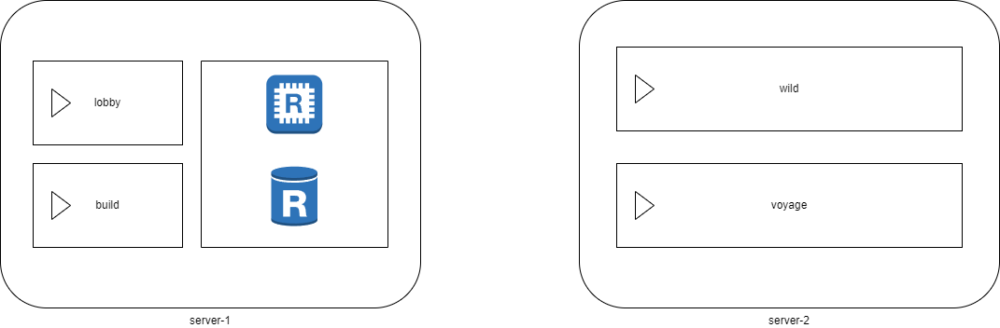

# 24.08.15 - 첫 회의
## 서버 구성 방안
- 던전은 항해 서버에 입구가 될 섬과 그 안에 던전으로 구성
  - 대신, 항해 서버의 크기는 고개 클것으로 예상 됨
- 야생 서버
  - 월드 크기 제한 필요
  - 주기적 초기화 고려(이로 인한, 주거지 설정 불가능)
  - 몬스터 스폰 제한( 항해 서버에만 추가 )
- 건축 서버
  - 로비와 같이 구성
  - 월드 크기 제한
  - 유저들 거주지 및 건축이 가능하도록 구성
- 프록시 서버
  - 유저 접속 관리 및 로비 연결
  - 서버 간 데이터 전송 및 동기화
  - 서버 상태 모니터링 필요
  
